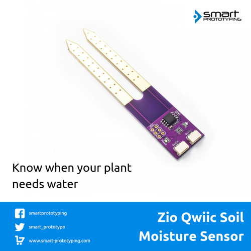

# Zio Qwiic Soil Moisture Sensor

> This product can be available for purchase [here](https://www.smart-prototyping.com/Zio-Qwiic-Loudness-Sensor-I2C).

#### Description

This is a one of its kind Qwiic (I2C) version Soil moisture sensor that helps you build an auto-watering system in a quick and easy way. 

Put the sensor’s exposed pads (probes) into the soil, and it will tell you the plant’s moisture rate from 0 to 1023 (0 means completely moist, 1023 means completely dry). You just need to decide at which rate to water, and how much water you want to give the plant. We have provided a demo code here for your reference.

*About the I2C:*

The module incorporates an ATtiny85 MCU as the I2C gateway, which does all the nitty gritty stuff for you. The default I2C address is 0x28, which you can also change depending on your requirements. You can check out the datasheet [here](http://ww1.microchip.com/downloads/en/DeviceDoc/Atmel-2586-AVR-8-bit-Microcontroller-ATtiny25-ATtiny45-ATtiny85_Datasheet.pdf)

#### Specification

* I2C address: 0x07- 0x78 (Default: 0x28)
* Gateway MCU: ATtiny85-20SU
* Probes Surface Finish: Gold Immersion
* Weight: 6.0g
* Module dimension: 20.3x 100.0mm

#### Links

* [PCB Source File and Schematic](https://github.com/ZIOCC/Zio-Qwiic-Soil-Moisture-Sensor)
* [Demo Code](https://github.com/ZIOCC/Zio-Qwiic-Soil-Moisture-Sensor/tree/master/Firmware/Qwiic%20Soil%20Moisture%20Sensor%20Examples)
* [ATtiny85 Gateway Firmware](https://github.com/ZIOCC/Zio-Qwiic-Soil-Moisture-Sensor/tree/master/Firmware/Qwiic_Soil_Moisture_Sensor_Gateway_Firmware/Qwiic_Soil_Moisture_Firmware)
* [Quick Start Tutorial](https://www.smart-prototyping.com/blog/Zio-Soil-Moisture-Sensor-Qwiic-Start-Guide)

###### About Zio
> Zio is a new line of open sourced, compact, and grid layout boards, fully integrated for Arduino and Qwiic ecosystem. Designed ideally for wearables, robotics, small-space limitations or other on the go projects. Check out other awesome Zio products [here](https://www.smart-prototyping.com/Zio).
